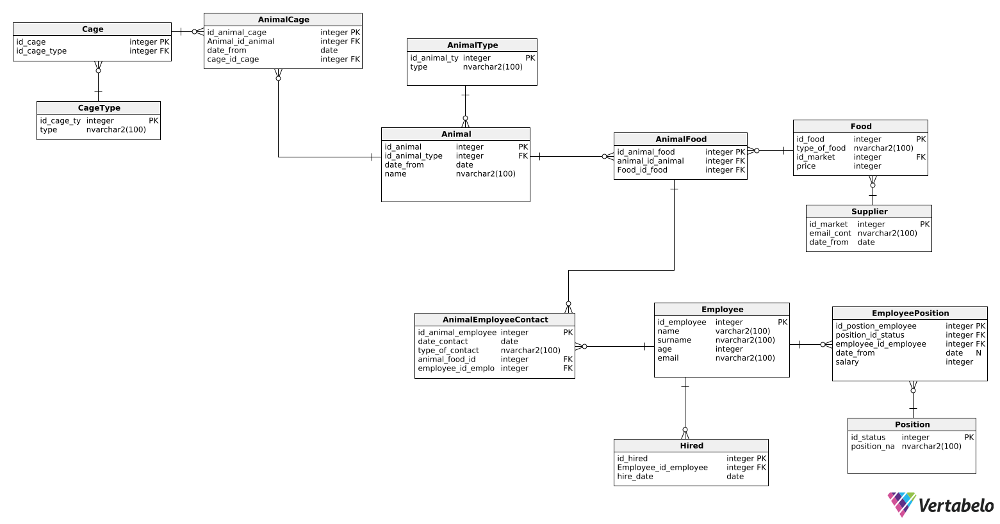

Great! Here’s the final version of your README text in proper Markdown format, ready to use on GitHub:

# 📦 Database Management System

This project provides SQL scripts for managing a comprehensive database system tailored for farm operations. It supports user roles, blog content, and detailed records for animals, employees, cages, food supplies, and more. Additionally, it includes procedures and triggers for dynamic management of employee-animal assignments, salary validations, and cage updates.

---

## 🐄 Topic Description

The system handles the following aspects:

1. **Animal Management** – Tracks species, names, and arrival dates.
2. **Cage Management** – Records cage types and housed animals.
3. **Employee Management** – Stores staff names, ages, and email contacts.
4. **Employee Positions** – Manages job titles, hire dates, and salaries.
5. **Animal Care** – Logs which employees care for which animals, along with care types and dates.
6. **Food Management** – Maintains food types, suppliers, and pricing.
7. **Animal Feeding** – Documents which animals receive specific foods.
8. **Supplier Management** – Stores supplier contact details and service start dates.

---

---

## 🗃️ Database Structure

The database includes the following core tables:

### 🔐 User & Role Management

- **`role`** – Stores roles with `id` and `name`.
- **`user`** – Stores users with `id` and `email`.
- **`user_roles`** – Maps users to roles (`user_id`, `role_id`).

### 📝 Blog Content

- **`blog`** – Stores blogs with `id`, `name`, and `manager_id`.
- **`article`** – Stores articles with `id`, `title`, `author_id`, and `blog_id`.

### 🐾 Animal Management

- **`animal`** – Stores animal details (`id`, `species`, `name`, `arrival_date`, etc.).
- **`animal_care`** – Tracks care assignments (`employee_id`, `animal_id`, `care_type`, `care_date`).
- **`animal_feeding`** – Links animals with food (`animal_id`, `food_id`, `feeding_date`).

### 🏠 Cage Management

- **`cage`** – Stores cage info (`id`, `type_id`, capacity).
- **`cage_type`** – Defines types of cages (e.g., Small, Large, Aquatic).

### 👨‍🌾 Employee & Position Management

- **`employee`** – Holds employee data (`id`, `full_name`, `age`, `email`).
- **`employee_position`** – Tracks positions (`employee_id`, `position_id`, `hire_date`, `salary`).
- **`position`** – Defines job roles (e.g., Vet, Feeder, Cleaner).

### 🍽️ Food & Supplier Management

- **`food`** – Lists food types (`id`, `name`, `price`, `supplier_id`).
- **`supplier`** – Holds supplier contact info and `start_date`.

---

### 📊 Entity Relationship Diagram

